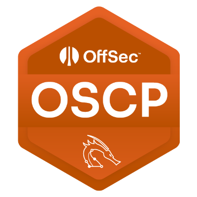

# Hi there 👋

I'm a Security Engineer and Developer.

## 📫 How to reach me

- LinkedIn: [Bilguun Ganchuluun](https://www.linkedin.com/in/bilguun-ganchuluun-61b7141b0)
- Instagram: [bekkage7](https://www.instagram.com/bekkage7)
- Email: [bilguunsec@gmail.com](mailto:bilguunsec@gmail.com)

## ⭐ Certifications

## 🔧 Technologies & Tools

## &#x1f4c8; GitHub Stats

